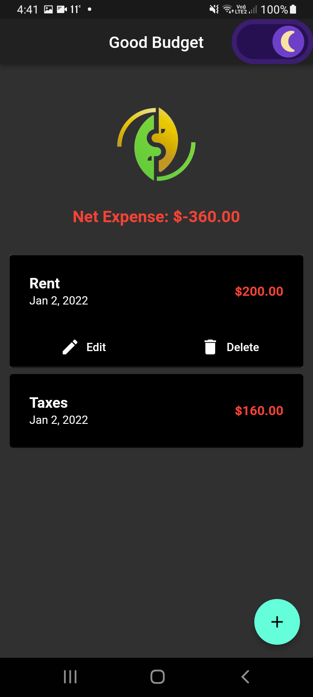

# Good Budget

A budget monitor or expense tracker Flutter application that persists data with Hive NoSQL database. This cross platform application is available on Android, iOS & Web. Both expenses and income are tracked.

### Android App Demonstration

<a href='https://github.com/Sherida101/GoodBudget/releases/download/v1.0.0/goodBudgetDemo.apk'>Download Good Budget Android apk</a>

Star ⭐ the repository if you like what you see 😉.

## 📽📸 &ensp;Preview

|                                                  Light Theme                                                  |                                                  Dark Theme                                                   |
| :-----------------------------------------------------------------------------------------------------------: | :-----------------------------------------------------------------------------------------------------------: |
|  |  |

## Screens

|                **Light Theme - Home**                 |                 **Dark Theme - Home**                  |             **Light Theme - Add Transaction**             |             **Dark Theme - Add Transaction**              |
| :---------------------------------------------------: | :----------------------------------------------------: | :-------------------------------------------------------: | :-------------------------------------------------------: |
|  |  |  |  |

## Features

- [✅] Add, edit or delete an expense transaction
- [✅] Add, edit or delete an income transaction
- [✅] Save data to Hive database
- [✅] Dark theme support
- [✅] Splash screen
- [❌] Sort transactions by date and name
- [❌] Search

## ✨ Requirements

- Any Operating System (ie. MacOS X, Linux, Windows)
- Any IDE with Flutter SDK installed (ie. IntelliJ, Android Studio, VSCode etc)
- Knowledge of Dart, Flutter and Hive database

## Getting Started

This project is a starting point for a Flutter application.

A few resources to get you started if this is your first Flutter project:

- [Lab: Write your first Flutter app](https://flutter.dev/docs/get-started/codelab)
- [Cookbook: Useful Flutter samples](https://flutter.dev/docs/cookbook)

For help getting started with Flutter, view our
[online documentation](https://flutter.dev/docs), which offers tutorials,
samples, guidance on mobile development, and a full API reference.

## ⚡&ensp;Social Media

&ensp;YouTube: [@Sherida Providence](https://www.youtube.com/obAZ9eizOU77HaEoLn0jHA?sub_confirmation=1 "YouTube Sherida Providence")

&ensp;Facebook: [@Aaliyah Providence](https://www.facebook.com/smileysherida "Facebook Aaliyah Providence")

&ensp;LinkedIn: [@Aaliyah Providence](https://linkedin.com/in/aaliyah-providence-0355b321a/ "LinkedIn Aaliyah Providence")

&ensp;GitHub: [@Sherida101](https://github.com/Sherida101 "GitHub Sherida101")

# References 👏🏻

- Concept was taken from [Johannes Milke's Hive Database project](https://github.com/JohannesMilke/hive_database_example).
